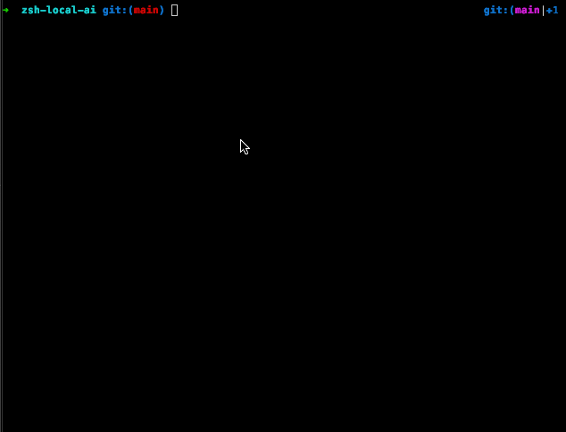

# Use AI models in terminal locally, free and without a connection.



## Table of contents

- [Use AI models in terminal locally, free and without a connection.](#use-ai-models-in-terminal-locally-free-and-without-a-connection)
  - [Table of contents](#table-of-contents)
  - [What is this?](#what-is-this)
  - [Requirements](#requirements)
  - [In your terminal](#in-your-terminal)
    - [Install](#install)
      - [Install zsh\_local\_ai plugin](#install-zsh_local_ai-plugin)
      - [Using oh-my-zsh edit ~/.zshrc](#using-oh-my-zsh-edit-zshrc)
      - [Reload zsh](#reload-zsh)
      - [Run local api in docker](#run-local-api-in-docker)
      - [Fetch the models](#fetch-the-models)
    - [Make your first request](#make-your-first-request)
  - [Usage](#usage)
  - [License](#license)

## What is this?

This is a simple api that runs locally and can be used to run ai models locally without internet connection and for free. It uses [Hugging Face](https://huggingface.co/) transformers library to load the models and [FastAPI](https://fastapi.tiangolo.com/) to serve the api. It also uses [Docker](https://www.docker.com/) to run the api in a container.

## Requirements

- Docker
- Docker-compose
- Make
- Zsh
- Oh-my-zsh
- Python3

## In your terminal

### Install

#### Install zsh_local_ai plugin

```bash
cp -r zsh-local-ai ~/.oh-my-zsh/custom/plugins/
```

#### Using oh-my-zsh edit ~/.zshrc

Where plugins=() add zsh-local-ai to the list
Add a key binding to create_completion function

```bash
......
plugins=(....... zsh-local-ai .......)

bindkey '^X' create_completion
```

#### Reload zsh

```bash
source ~/.zshrc
```

#### Run local api in docker

Wont demonize the process, so you can see the logs (Also debug mode is on)

```bash
make start
```

#### Fetch the models

This will take a while to download the models for the first time

```bash
make get_models
```

### Make your first request

That will take a while to load the model for the first time

```bash
make test
```

## Usage

Start typing the command or a comment and press ctrl+x to get the completion. Then press enter to run the command.


## License

[MIT](LICENSE)